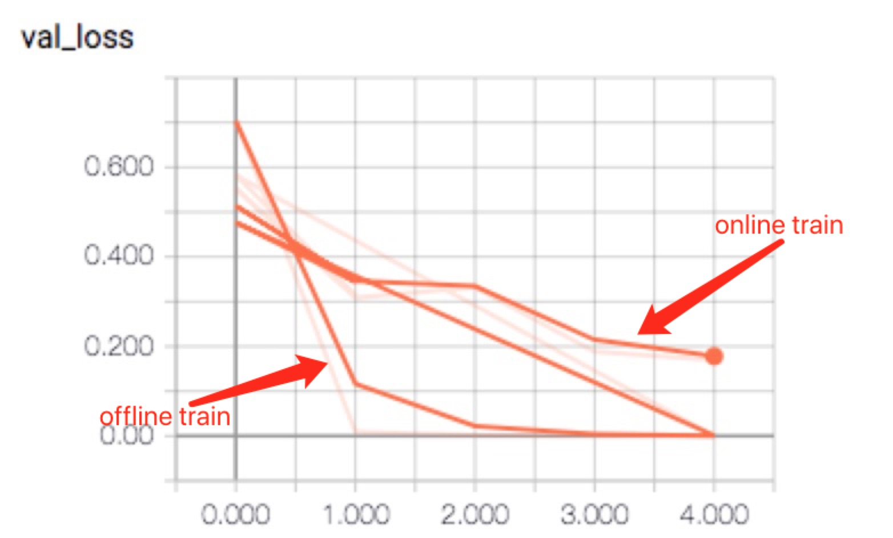
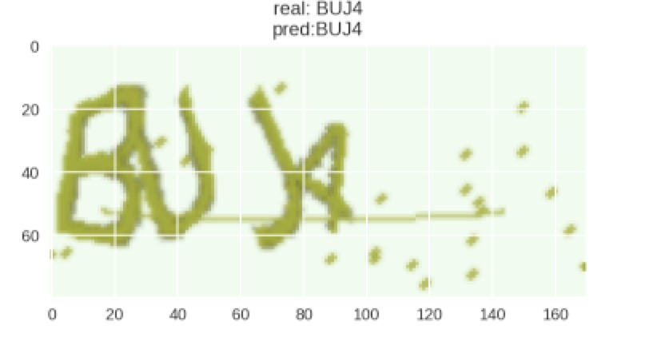

本文是对 https://ypw.io/captcha/ 的验证码训练的改造，目的是解决不容易训练成功的å问题。

方法是使用预先生成少量数据先训练出较好的模型，然后再使用online的captcha做训练，更加容易训练成功。

## 预先生成一部分数据作为稳定的数据集(offline dataset)
```
npy_file_count = 10
count_each_npy = 128
rootdir="./data/"
!rm -fr ${rootdir}
mkdir_p(rootdir)

print("start to generate, total count - " + str(npy_file_count * count_each_npy))
for t in range(0,npy_file_count):
   X, y = next(gen(count_each_npy))
   np.save(rootdir + str(t) + ".npy", [X, y])
```

## 编写对offline数据集的产生函数
```
def batch_gen(batch_size = 16):
  batch_idx = 0
  while True:
      [X_all, y_all] = np.load(rootdir + str(batch_idx) + ".npy")
      for i in range(count_each_npy/batch_size):
          yield X_all[(i * batch_size):((i+1) * batch_size)], [y_all[j][(i * batch_size):((i+1) * batch_size)] for j in range(4)]
      batch_idx += 1
      batch_idx %= npy_file_count
```

## 替换之前直接使用online的数据集，使用offline数据集做训练
```
model.fit_generator(batch_gen(), samples_per_epoch=1280, nb_epoch=5, 
                    nb_worker=2, pickle_safe=True, 
                    validation_data=batch_gen(), nb_val_samples=160)
model.save_weights("captcha-offline.h5")
```
此时，一般会得到较为收敛的结果，我自己跑的是 train loss=0.08, val loss=0.1，但是evaluate的结果很差： 0.03 （使用online的数据集做evaluate）

## 使用oneline的数据集做fine tuning
```
# train by online
model.fit_generator(gen(), samples_per_epoch=1280, nb_epoch=5, 
                    nb_worker=2, pickle_safe=True, 
                    validation_data=gen(), nb_val_samples=160)
model.save_weights("captcha-online.h5")
```

注意：优化器使用adadelta，不要使用SGD， learning rate可不调。  

两次跑的结果对比如下：  


## 对模型做evaluate
```
from tqdm import tqdm
def evaluate(model, batch_num=32):
    batch_acc = 0
    generator = gen()
    for i in tqdm(range(batch_num)):
        X, y = next(generator)
        y_pred = model.predict(X)
        y_pred = np.argmax(y_pred, axis=2).T
        y_true = np.argmax(y, axis=2).T
        batch_acc += np.mean(map(np.array_equal, y_true, y_pred))
    return batch_acc / batch_num

evaluate(model)
```

运行的结果：
```
100%|██████████| 32/32 [00:04<00:00,  7.61it/s]
0.9365234375
```

## 原因分析
> 验证码的产生很随机，直接train一个model，可能需要耗费很长的时间才能走出。我自己训练下来，十几次才有一次会从loss在14.4突然降低到5.0附近，随机性比较大。   
> 先用少量数据做pre-train，得到一个overfitting很厉害的model，然后在用online的数据继续train，这样两步法，会让整个训练的时间效率大大提升。  

一个case：


很喜欢深度学习的原因之一，是这个东西是可以迭代的，这个现实世界非常契合。