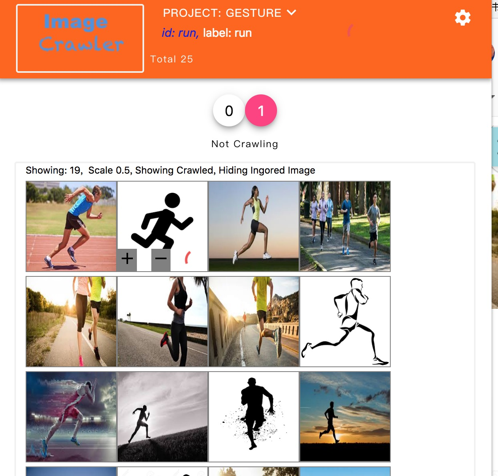

本文主要实践了一个完成的DeepLearning的最小工作集
> 1. 构造测试数据集
> 2. 做训练

问题是：能够找到一些图片，区分出图片是走路还是跑步 (walk or run)。

## 1. 构造训练集
做了一个快速构造训练集的工具 - 一个基于chrome的插件，在google images中可以快速的选择图片集，然后定义标签，上传到google storage中:



基于这个工具, 大约花了半小时时间，在google image中搜索"run", "walk", "run outside" , "walk outside"等，获得到约600张图片。

然后上传到了 [kaggle dataset](https://www.kaggle.com/huan9huan/walk-or-run)中：


## 训练 - 使用DenseNet做fine tuning
直接说结果，使用keras的DenseNet的pre-trained的模型，加上一个inception的结构作为head model来进一步的提取DenseNet的feature，获得到了 **90%** 的成功率（validation dataset上）。kernels参见 [walk or run, fine tuning
](https://www.kaggle.com/huan9huan/walk-or-run-fine-tuning?scriptVersionId=5052538)

具体来说:

### 1.数据分割
> 1. 80%训练集（train dataset）
> 2. 20%交叉测试集（validation dataset）

### 2. 模型构造：
```
# build model

def conv2d_bn(x,
              filters,
              num_row,
              num_col,
              padding='same',
              strides=(1, 1),
              name=None):
    filters = int(filters)
    x = Conv2D(
        filters, (num_row, num_col),
        strides=strides,
        padding=padding,
        use_bias=False,
        name=name + "_conv")(x)
    x = BatchNormalization(scale=False, name=name + "_bn")(x)
    x = Activation('relu', name=name)(x)
    return x 

def incept(x, name="incept", scale=1):
    branch1x1 = conv2d_bn(x, 64 // scale, 1, 1, name = name + "-1x1")

    branch5x5 = conv2d_bn(x, 48 // scale , 1, 1, name = name + "-5x5-1x1")
    branch5x5 = conv2d_bn(branch5x5, 64 // scale, 5, 5, name = name + "-5x5-5x5")

    branch3x3dbl = conv2d_bn(x, 64 // scale, 1, 1, name = name + "-3x3-1x1")
    branch3x3dbl = conv2d_bn(branch3x3dbl, 96 // scale, 3, 3, name = name + "-3x3-3x3-1")
    branch3x3dbl = conv2d_bn(branch3x3dbl, 96 // scale, 3, 3, name = name + "-3x3-3x3-2")

    branch_pool = AveragePooling2D((3, 3), strides=(1, 1), padding='same')(x)
    branch_pool = conv2d_bn(branch_pool, 32 // scale, 1, 1, name = name + "-pool")
    return concatenate(
        [branch1x1, branch5x5, branch3x3dbl, branch_pool],
        name= name + '-all')
  
def build_head_model(input_shape, n_classes = 2):
    head_input = Input(shape=input_shape, name = 'head_input')
    x = head_input
    x = Dropout(0.8)(x)
    x = incept(x, name="i2", scale=2)
    x = Flatten()(x)
    x = Dropout(0.8)(x)
    x = Dense(n_classes, activation='softmax', name='prediction')(x)
    return Model(input = head_input, output = x, name="dogs_ft_head_model")
  
def build_model(pretrained_model_name, n_classes):
    input = Input(shape=(224,224,3), name = 'image_input')
    x = input
    pretrained_model, _, preprocess = load_base(pretrained_model_name)
    for layer in pretrained_model.layers[:-1]:
        layer.trainable = False
    
    x = pretrained_model(x)
    head_model = build_head_model(x.get_shape()[1:].as_list(), n_classes)
    x = head_model(x)
  
    model = Model(input = input, output = x)
    model.compile(metrics=["accuracy"],
                  loss="categorical_crossentropy",
                  optimizer=optimizers.Adadelta())
    
    return model, head_model, preprocess
```

### 3. 其他的一些超参：
> 1. batch size: 32
> 2. steps each epoch: 160
> 3. 优化器是Adadelta，缺省参数

**注：本测试基于Google Colaboratory Notebook上提供的K80 GPU。**

## 补充：其他的pre-trained的模型的结果
> 1. 使用了 Vgg16或者ResNet50只能得到大约80%的val accu，不过值得注意的是vgg16的val loss很低(0.48)。
> 2. 使用了 InceptionResNetV2，得到了83%的成功率。
> 3. 使用了 MobileNetV2，得到了84%的成功率。

## 将来的工作
1. 自己抓取数据的时候，由于这个数据集是反映了我自己对walk还是run的判断，可能存在系统性偏误。解决的办法是让不同的人去贡献数据，从而可以消除这种系统性偏差。

2. 到底是什么特征在walk or run的判断做了关键的作用，也就是“why it works”的问题。一个方法是遍历数据集，然后得到walk和run的各自的最大的confidence的集合，从而比较分析这些数据的特征。

3. val loss和val accuracy并不一致，比如DenseNet的val loss是0.8，但是accuray是 90%，而vgg的loss是0.48，但是accuracy却是0.8左右，他们如何统一起来做模型的筛选，需要进一步的研究。


